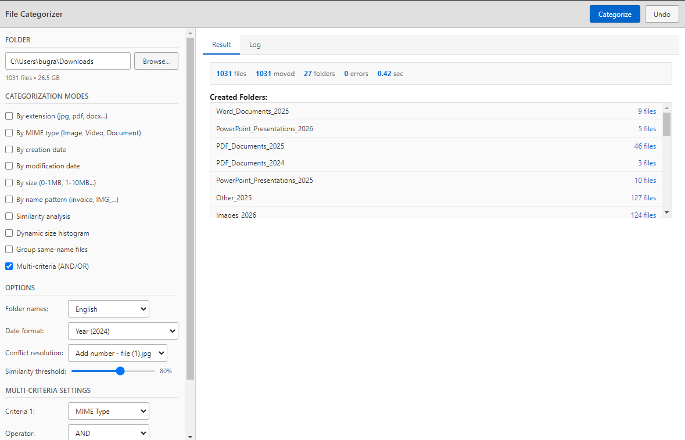

# File Categorizer

A desktop file categorization application using Electron and Python. Fully algorithmic and deterministic - no AI.



## Features

### 10 Categorization Modes

1. **By Extension** - jpg, png, pdf, docx, etc.
2. **By MIME Type** - Images, Videos, Audio, Documents
3. **By Creation Date** - YYYY / YYYY-MM / YYYY-MM-DD
4. **By Modification Date** - YYYY / YYYY-MM / YYYY-MM-DD
5. **By Size** - 0-1MB / 1-10MB / 10-100MB / 100MB-1GB / 1GB+
6. **By Name Pattern** - invoice, IMG_, VID_, etc.
7. **Similarity Analysis** - Levenshtein, Jaro-Winkler, LCS algorithms
8. **Dynamic Size Histogram** - Auto-calculated size ranges
9. **Same-Name Clustering** - presentation.pdf + presentation.pptx = same folder
10. **Multi-Criteria** - AND-OR combinations

### Core Features

- ✅ Simulation mode (preview before moving)
- ✅ Undo feature
- ✅ Operation logs (JSON format)
- ✅ Language selection (English/Turkish folder names)
- ✅ Progress indicator
- ✅ Detailed reporting

## Installation

### Requirements

- Node.js 18+ 
- Python 3.8+
- npm or yarn

### Steps

```bash
# Clone the project
git clone https://github.com/bugraskl/file-categorizer.git
cd file-categorizer

# Install dependencies
npm install

# Start the application
npm start
```

## Building

### Windows (.exe)

```bash
npm run build:win
```

### macOS (.dmg)

```bash
npm run build:mac
```

### Linux (.AppImage)

```bash
npm run build:linux
```

Packaged files will be created in the `dist/` folder.

## Usage

### Basic Usage

1. **Select Folder** - Click "Browse..." button
2. **Select Mode** - Choose one or more categorization modes
3. **Simulate** (Optional) - Preview changes with "Simulate" button
4. **Categorize** - Move files with "Categorize" button
5. **Undo** (If needed) - Restore files with "Undo" button

### Example Scenario

**Scenario: Organizing a photo archive**

1. Select the photos folder
2. Choose "By creation date" mode
3. Select "YYYY-MM" format in options
4. Run "Simulate" to preview
5. Confirm and click "Categorize"

**Result:**
```
Photos/
├── 2023-01/
│   ├── IMG_001.jpg
│   └── IMG_002.jpg
├── 2023-02/
│   └── IMG_003.jpg
└── 2024-01/
    └── IMG_004.jpg
```

## Options

| Option | Description |
|--------|-------------|
| Language | English or Turkish folder names |
| Date Format | YYYY, YYYY-MM, or YYYY-MM-DD |
| Conflict Resolution | Add number or timestamp |
| Similarity Threshold | 50-100% adjustable |

## Project Structure

```
file-categorizer/
├── package.json
├── src/
│   ├── main/
│   │   ├── main.js
│   │   └── preload.js
│   ├── renderer/
│   │   ├── index.html
│   │   ├── css/styles.css
│   │   └── js/renderer.js
│   └── python/
│       ├── categorizer.py
│       ├── similarity.py
│       ├── undo_manager.py
│       └── utils.py
├── logs/
└── dist/
```

## Undo System

Each categorization operation automatically creates a log file:

```json
{
  "timestamp": "2024-02-04T15:48:00",
  "folder": "C:/Users/Documents",
  "modes": ["extension", "size"],
  "total_files": 150,
  "operations": [...]
}
```

When "Undo" is clicked:
1. All files are moved back to original locations
2. Empty folders are deleted
3. Log file is archived

## Development

```bash
# Run in development mode
npm start

# Run Python tests
python src/python/categorizer.py --test
python src/python/similarity.py
python src/python/utils.py
```

## License

MIT License
